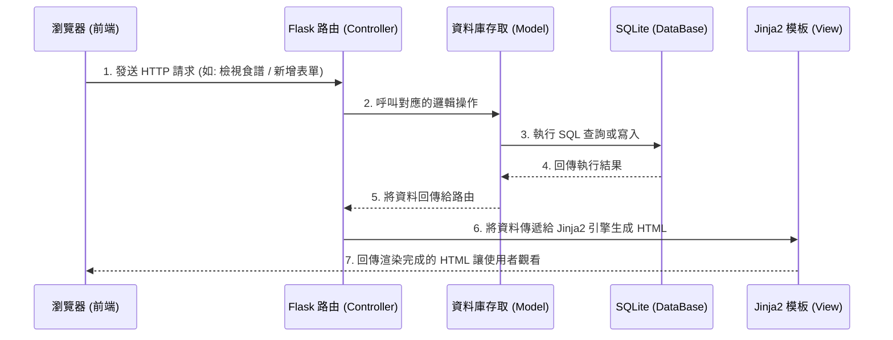

# 系統架構設計文件：食譜收藏夾

## 1. 技術架構說明

本專案採用經典的伺服器端渲染（Server-Side Rendering, SSR）架構，藉由 Flask 與 Jinja2 結合，快速完成輕量級網頁應用程式。

- **選用技術與原因**：
  - **後端框架：Python + Flask**  
    Flask 是一個輕量、具彈性的 Web 框架，適合快速開發單純的 CRUD 應用系統（如食譜收藏），進入門檻低且能夠輕鬆駕馭。
  - **模板引擎：Jinja2**  
    因為專案不採用前後端分離，直接透過 Flask 內建支援的 Jinja2 引擎進行 HTML 渲染，可將後端拿到的資料快速嵌入至前端畫面中。
  - **資料庫：SQLite**  
    作為輕便的關聯式資料庫系統，不需要額外安裝或設定資料庫伺服器，資料儲存在單一檔案中。對於個人/家庭自用等級的食譜庫而言，效能和容量皆已非常充足。

- **Flask MVC 模式說明**：
  - **Model（模型）**：負責底層邏輯與資料庫互動，包含處理食譜的新增、讀取、更新、刪除（CRUD）指令。
  - **View（視圖）**：負責畫面呈現，由寫好 HTML 與 Jinja2 語法的模板檔案組成，將後端的食譜資料轉為視覺化網頁。
  - **Controller（控制器）**：即 Flask 的路由 (Routes) 設計，主要負責接收來自使用者瀏覽器的 HTTP 請求，調用對應的 Model，再把處理好的資料交由 View 進行介面產生。

## 2. 專案資料夾結構

本專案的程式進入點與邏輯檔案分離，以便於日後維護，結構如下：

```text
web_app_development/
├── app/                  # 應用程式主邏輯資料夾
│   ├── __init__.py       # 應用程式與資料庫的初始化設定
│   ├── models/           # 存放資料庫邏輯（Model）
│   │   └── recipe.py     # 食譜表格定義與資料庫操作函式
│   ├── routes/           # 存放 Flask 路由（Controller）
│   │   └── recipe_rt.py  # 食譜相關的 CRUD 請求處理
│   ├── templates/        # 網頁模板（View）
│   │   ├── base.html     # 全域共用的網頁主板 (包含 Header 與 Footer)
│   │   ├── index.html    # 首頁，包含清單與關鍵字搜尋
│   │   ├── detail.html   # 單一食譜的內容與步驟詳情頁
│   │   └── form.html     # 用來新增或編輯食譜的表單頁面
│   └── static/           # 存放前端靜態檔案
│       ├── css/          # 樣式表檔案（負責 RWD 響應式排版）
│       ├── js/           # 客製化互動腳本
│       └── images/       # 用於儲存食譜相關的照片或預設圖
├── instance/             # 自動產生的實體資料放置區
│   └── database.db       # SQLite 實體資料庫檔案 (不進版控)
├── docs/                 # 系統文件
│   ├── PRD.md            # 產品需求文件
│   └── ARCHITECTURE.md   # 系統架構設計文件 (本文件)
├── requirements.txt      # 記錄各項 Python 相依套件版本
└── app.py                # 主要的啟動腳本 (入口點)
```

## 3. 元件關係圖

透過以下的流程圖可以了解使用者如何與系統互動並取得食譜資料：



## 4. 關鍵設計決策

1. **傳統的伺服器渲染 (SSR)**
   - **原因**：對於單純顯示文字和圖片為主的食譜網站，比起撰寫獨立的 React/Vue 前端加上 RESTful APIs，SSR 可以大幅縮短初期開發時間，讓 MVP 更快上線，而且對 SEO (搜尋引擎最佳化) 相對友善。
2. **採用 SQLite 原生套件或精簡 ORM**
   - **原因**：不需要架設 MySQL 伺服器，隨開即用，而且整個資料庫實體就是一個 `.db` 檔案，非常方便個人應用程式做到隨時搬家及整機備份。
3. **推行 Mobile-First (行動優先) 的響應式設計**
   - **原因**：PRD 定義系統使用者主要是家庭主婦，使用場域高度集中在做菜時的廚房。大部分使用者會拿手機或平板觀看，因此在寫 CSS 樣式時，預設優先考量手機螢幕寬度的可讀性（不需要放大縮小就能清晰閱讀步驟），並確保按鈕大小在設備上好被點擊。
