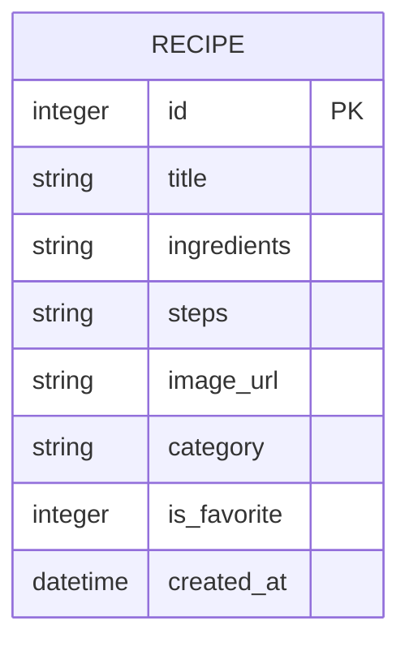

# 資料庫設計文件：食譜收藏夾

## 1. ER 圖

## 2. 資料表詳細說明

### `recipes` 表 (食譜表)

負責儲存使用者收藏的所有料理食譜紀錄。

| 欄位名稱 | 型別 | 必填 | 預設值| 說明 |
|----------|------|------|------|------|
| `id` | INTEGER | 是 | (無，自增) | Primary Key，食譜的唯一識別碼 |
| `title` | TEXT | 是 | (無) | 料理名稱 |
| `ingredients` | TEXT | 是 | (無) | 所需材料清單，可以接受換行符號的多行文字 |
| `steps` | TEXT | 是 | (無) | 料理步驟，可以接受換行符號的多行文字 |
| `image_url` | TEXT | 否 | NULL | 食譜成品照片的相對路徑或網址 (MVP Nice to Have) |
| `category` | TEXT | 否 | NULL | 料理分類，例如：主菜、湯品、甜點 (MVP Nice to Have) |
| `is_favorite` | INTEGER | 否 | 0 | 標記為我的最愛 (0: 否, 1: 是) (MVP Nice to Have) |
| `created_at` | DATETIME | 否 | CURRENT_TIMESTAMP | 資料建立時間，用於前端「最新建立排序」 |

