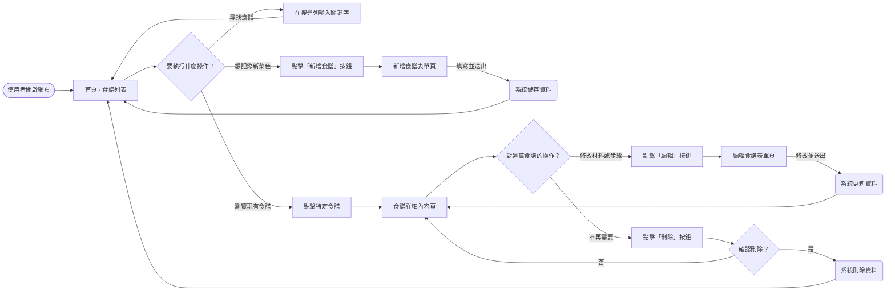
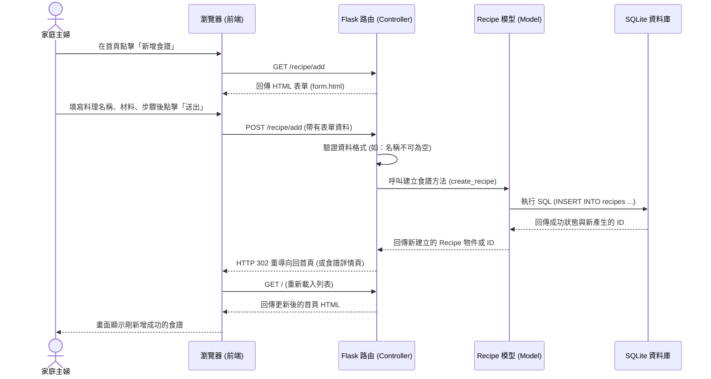

# 流程圖文件：食譜收藏夾

本文件描述了系統中的主要使用者操作路徑以及底層資料流的序列圖。

## 1. 使用者流程圖 (User Flow)

這個流程圖展示出家庭主婦從開啟網頁開始，可能會採取的各種操作路線。

## 2. 系統序列圖 (Sequence Diagram)

以下序列圖具體描述了使用者在「新增食譜」時，前端（瀏覽器）到後端（Flask、Model、SQLite）如何串聯處理並儲存資料的完整流程。

## 3. 功能清單對照表

本表列出了所有主要操作功能以及對應的系統路由與 HTTP 動詞。

| 功能 | URL 路徑 | HTTP 方法 | 說明 |
| --- | --- | --- | --- |
| **瀏覽首頁 (列表)** | `/` | `GET` | 顯示所有食譜，支援關鍵字搜尋 (例如 `/?q=牛肉`) |
| **查看食譜詳情** | `/recipe/<id>` | `GET` | 顯示該食譜的詳細材料與完整步驟 |
| **顯示新增表單** | `/recipe/add` | `GET` | 顯示讓使用者填寫新食譜資訊的表單畫面 |
| **提交新增資料** | `/recipe/add` | `POST` | 接收表單內容，寫入資料庫並返回首頁 |
| **顯示編輯表單** | `/recipe/<id>/edit` | `GET` | 帶入既有資料，顯示編輯表單畫面 |
| **提交編輯資料** | `/recipe/<id>/edit` | `POST` | 接收修改後的內容，更新資料庫並返回詳情頁 |
| **刪除食譜** | `/recipe/<id>/delete` | `POST` | 接收刪除請求，移除資料並返回首頁 |
